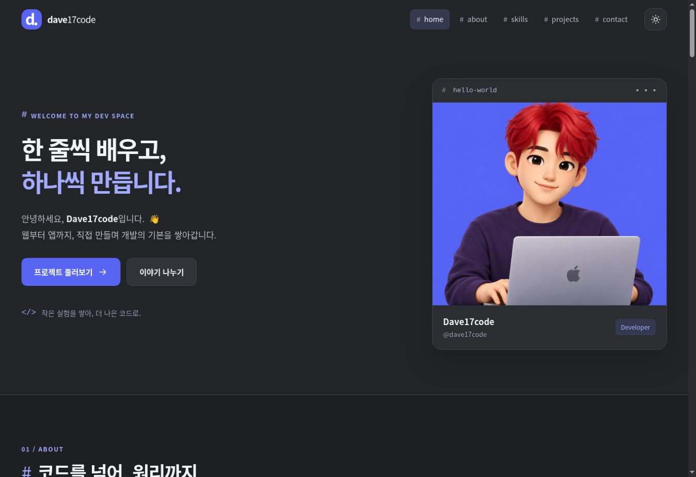
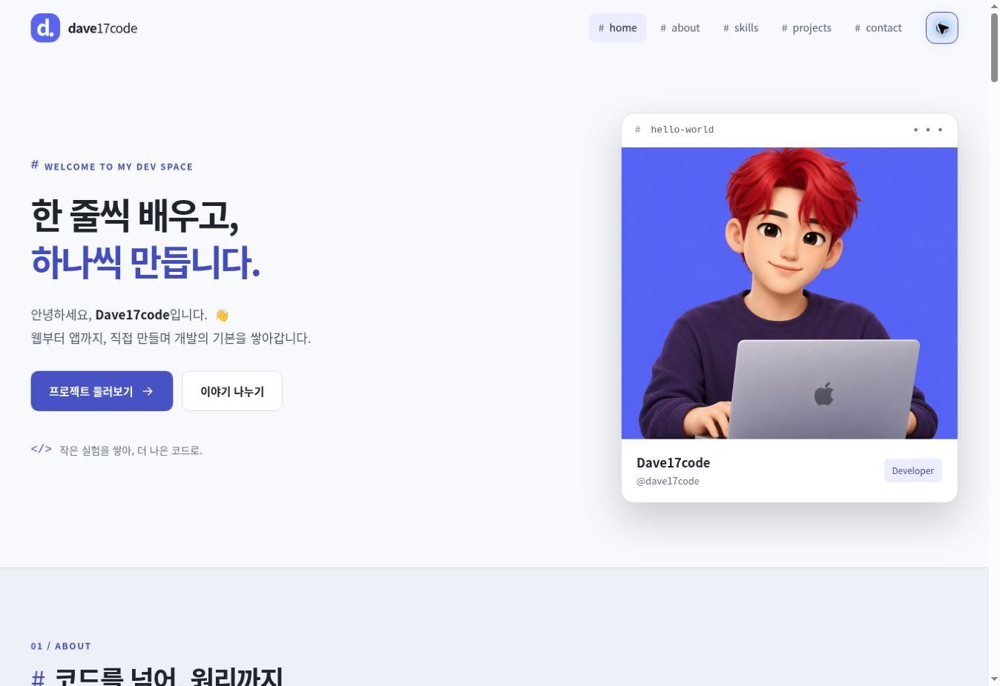
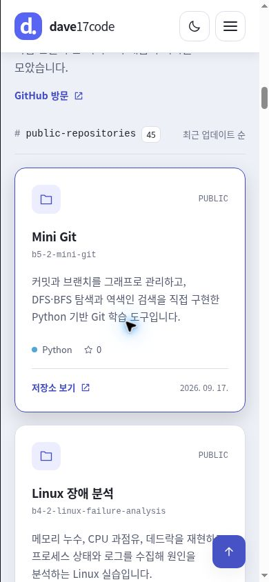
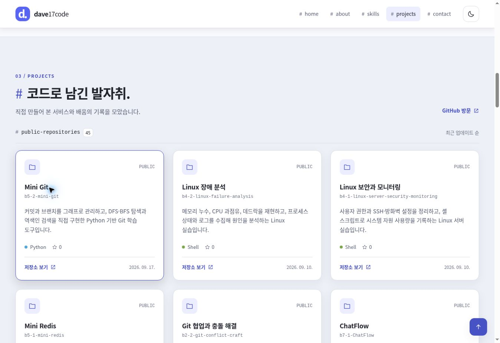

# Dave17code · Developer Portfolio

순수 HTML, CSS, JavaScript로 만든 B1-1 포트폴리오입니다. Discord에서 영감을 받은 짙은 회색과 블러플 색상, 채널 형태의 메뉴를 사용했습니다.

**현재 상태: 프로젝트 구현 완료 · GitHub Pages 배포 전.** 아래 주소는 `b1-1-portfolio` 저장소를 만들었을 때의 예정 주소입니다. 실제 배포 후 접속을 확인하고 상태 문구를 수정해 주세요.

| 항목 | 주소 |
| --- | --- |
| 작성자 GitHub | [dave17code](https://github.com/dave17code) |
| 제출 저장소 URL · 생성 예정 | `https://github.com/dave17code/b1-1-portfolio` |
| 사이트 URL · 배포 예정 | `https://dave17code.github.io/b1-1-portfolio/` |

## 바로 시작하기

1. ZIP을 **압축 해제**합니다.
2. VS Code에서 `index.html`이 있는 `dave-portfolio` 폴더를 엽니다.
3. 확장 프로그램 **Live Server**(`ritwickdey.LiveServer`)를 설치합니다. 폴더의 권장 확장에도 등록했습니다.
4. `index.html`을 오른쪽 클릭 → **Open with Live Server**를 선택합니다.
5. 최신 Chrome에서 확인합니다. 저장하면 변경 사항이 반영됩니다.

`npm install`이나 빌드는 필요하지 않습니다. 파일을 더블클릭하는 방식보다 HTTP 서버인 Live Server 사용을 권장합니다. 외부 SVG 아이콘과 API 동작을 같은 환경에서 확인하기 위함입니다.

**배포는 [DEPLOY.md](DEPLOY.md), 필수 요구사항 대응은 [docs/REQUIREMENTS.md](docs/REQUIREMENTS.md), 시연은 [docs/DEMO.md](docs/DEMO.md)를 확인하세요.**

## 사용 기술과 범위

- HTML5 시맨틱 마크업
- CSS 변수, Flexbox, Grid, 모바일 퍼스트 미디어 쿼리
- Vanilla JavaScript: DOM, 이벤트, 상태, `fetch`, `async/await`, Intersection Observer
- GitHub REST API · localStorage
- 로컬 PNG 프로필과 직접 작성한 SVG UI 아이콘

외부 라이브러리·프레임워크·CSS 프레임워크·아이콘 라이브러리·웹 폰트를 불러오지 않습니다. 페이지의 코드와 CSS는 모두 이 프로젝트 파일입니다. Projects 카드에 소개된 다른 저장소가 React나 Swift 등을 사용한다는 설명은 **이 포트폴리오 자체의 구현 기술과 별개**입니다.

선택 기능인 프로젝트 필터, 별도의 게임, 실제 이메일 전송 서버, 로그인 등은 구현 범위에 포함하지 않았습니다.

## 화면 구성

| 섹션 | 내용 |
| --- | --- |
| Hero | 인사말, Projects·Contact 이동 CTA, 프로필 캐릭터 |
| About | 자기소개와 프로필 이미지 |
| Skills | HTML/CSS, JavaScript, TypeScript, Python, Swift, Git/GitHub |
| Projects | 실제 GitHub 공개 저장소 목록, 핵심 설명, 언어, 스타, 갱신일, 저장소 링크 |
| Contact | 이름·이메일·메시지 입력, 유효성 검사, 성공 안내 |
| Footer | 현재 연도의 저작권 표시와 GitHub 링크 |

## 화면 미리보기

아래는 로컬 Chrome 렌더링 결과입니다. 공개 배포를 증명하는 스크린샷은 아니므로, 최종 제출 전 배포 주소에서도 확인해 주세요.

### 데스크톱 · 다크 모드



### 데스크톱 · 라이트 모드



### 모바일



### Projects



## 주요 설정

| 설정 | 값 / 설명 |
| --- | --- |
| 최초 테마 | 다크 모드 |
| 저장 키 | `dave-portfolio-theme` · `light` 또는 `dark` |
| 모바일 메뉴 | 768px 미만에서 햄버거 버튼, 768px 이상에서 메뉴 표시 |
| 필수 미디어 쿼리 | `min-width: 768px`, `min-width: 1024px` |
| 큰 화면 보완 | 1600px, 2400px, 3200px에서 콘텐츠 폭·글자·여백 조정 |
| 헤더 배경 변경 | `scrollY >= 60` |
| 맨 위 버튼 표시 | `scrollY >= 300` |
| 스크롤 애니메이션 | Intersection Observer `threshold: 0.2`, 한 번 표시 후 관찰 종료 |
| 애니메이션 줄이기 | `prefers-reduced-motion: reduce`에서는 부드러운 이동·등장 효과 생략 |
| API 요청 제한 시간 | 전체 목록 요청에 15초, 초과 시 안내와 재시도 제공 |
| API 페이지 크기 | `per_page=100`, 다음 페이지가 있으면 이어서 조회 |

## GitHub API와 카드 설명

호출 주소:

```text
https://api.github.com/users/dave17code/repos?per_page=100&sort=updated&direction=desc&type=owner&page=1
```

목록은 API 응답을 사용합니다. 카드 배열을 가짜 데이터로 채우거나, API 실패 시 샘플 프로젝트를 성공 화면처럼 보여주지 않습니다.

| API 상태 | 화면 |
| --- | --- |
| loading | 스피너와 로딩 안내, `aria-busy="true"` |
| success | `map`과 템플릿 리터럴로 실제 저장소 카드 생성 |
| error | 오류 설명과 **다시 시도** 버튼 |
| empty | **표시할 프로젝트가 없습니다.** |

2026-09-19 확인 당시 공개 저장소는 **45개**, GitHub 소개란 `description`은 모두 비어 있었습니다. 그래서 각 저장소의 README와 기본 브랜치 소스를 확인하고 `js/project-descriptions.js`에 제목과 한국어 설명을 작성했습니다. 설명은 저장소 크기와 관계없이 **핵심 한 문장, 비슷한 분량**으로 통일했으며 같은 설명 영역을 사용합니다. 확인 근거는 [docs/REPOSITORY-NOTES.md](docs/REPOSITORY-NOTES.md)에 있습니다.

`b1-1-portfolio`라는 이름으로 배포할 새 포트폴리오 저장소의 설명도 미리 준비되어 있으며, 실제 API 목록에 나타날 때 표시됩니다. 새 저장소도 API 목록에 자동으로 나타납니다. 사전에 없는 저장소는 GitHub 소개란을 짧게 표시하고, 소개란도 없다면 일반 안내를 표시합니다. 새 프로젝트의 상세 내용을 자동으로 분석하지는 않습니다. 설명을 맞추려면 `project-descriptions.js`에 해당 저장소 이름을 키로 추가하세요. 저장소를 삭제하면 API 목록에서도 사라지므로 사전의 남은 항목은 표시되지 않습니다.

인증 없는 GitHub API 요청은 일반적으로 IP 기준 시간당 60회입니다. 이 프로젝트는 카드별 추가 API를 호출하지 않으며, 45개 목록은 한 번의 요청으로 가져옵니다. 자동 재시도나 주기적 새로고침도 없습니다. 403·429 응답은 오류 UI로 처리하므로 반복 새로고침을 피하고 잠시 기다려 주세요. 브라우저 코드에 토큰을 넣을 필요가 없습니다.

## 이벤트 → 상태 → 렌더링

| 기능 | 이벤트 | 변경하는 상태 | 화면 반영 |
| --- | --- | --- | --- |
| 테마 | 테마 버튼 `click` | `state.theme` | `renderTheme()` → `data-theme`, 버튼 상태 |
| 메뉴 | 햄버거 `click`, Escape | `state.menuOpen` | `renderMenu()` → `active`, `aria-expanded` |
| Projects | 초기 호출, 재시도 `click` | `state.projects` | `renderProjects()` → 로딩/카드/오류/빈 화면 |
| 폼 | `input`, `blur`, `submit` | `state.form` | `renderField()`, `renderFormStatus()` → 오류·성공 |

`app.js`는 학습을 위해 네 기능과 초기화 순서가 보이도록 주석을 달았습니다. 폼 제출은 `preventDefault()`로 새로고침을 막고, 공백뿐인 입력도 빈 값으로 처리합니다. 틀린 항목을 고치면 입력 이벤트로 오류가 사라집니다.

**Contact는 유효성 검사 데모입니다.** 이름·이메일·메시지를 서버에 전송하거나 localStorage에 보관하지 않습니다. 정상 입력 시에도 실제 발송이 아니라 입력 확인이 완료되었음을 명확하게 안내합니다.

## 파일 역할

| 파일·폴더 | 역할 |
| --- | --- |
| `index.html` | 시맨틱 구조, 폼과 앵커, 외부 파일 연결 |
| `css/style.css` | 디자인 토큰, 두 테마, 모바일 퍼스트 레이아웃, 효과 |
| `js/app.js` | 이벤트, 상태, DOM 렌더링, API, 폼 검증 |
| `js/project-descriptions.js` | 저장소별 제목과 핵심 설명 |
| `images/profile.png` | 빨간 머리·맥북 캐릭터 |
| `images/icons.svg`, `images/favicon.svg` | UI 아이콘과 사이트 아이콘 |
| `images/screenshots/` | 데스크톱·모바일·테마·Projects 화면 |
| `DEPLOY.md` | GitHub 업로드와 Pages 배포 절차 |
| `docs/` | 요구사항 대응표, 시연·검증, 저장소 설명 근거 |
| `.vscode/` | Live Server 권장 확장과 개발 설정 |
| `.nojekyll` | 별도의 Jekyll 처리 없이 정적 파일 제공 |

프로필은 이 프로젝트용으로 생성한 3D 이모지 스타일 이미지입니다. Apple의 공식 이모지 파일을 복제해 배포한 것이 아닙니다. 디자인은 Discord에서 영감을 받았으며 Discord 공식 서비스가 아닙니다.

## 제출 전 확인

- [ ] GitHub 저장소 생성·업로드 완료
- [ ] GitHub Pages 배포 성공
- [ ] 실제 배포 주소에서 반응형·메뉴·테마·API·폼 확인
- [ ] 이 README의 예정 URL과 배포 전 상태 문구를 실제 결과로 갱신
- [ ] 저장소 URL, 배포 URL, 데스크톱·모바일·다크모드 스크린샷 제출

API는 [GitHub REST API 문서](https://docs.github.com/en/rest/repos/repos#list-repositories-for-a-user), 배포는 [GitHub Pages 공식 안내](https://docs.github.com/en/pages/getting-started-with-github-pages/configuring-a-publishing-source-for-your-github-pages-site)를 참고합니다.
